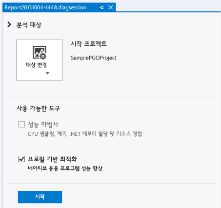
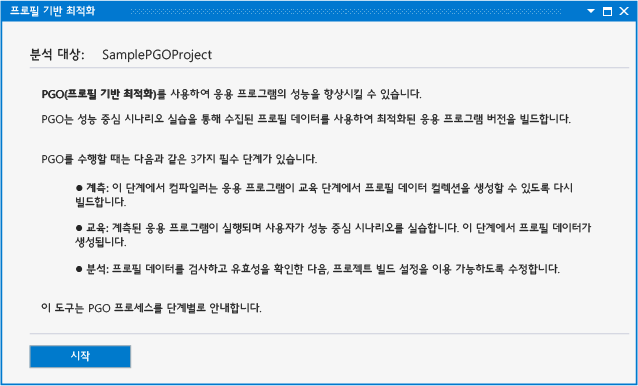
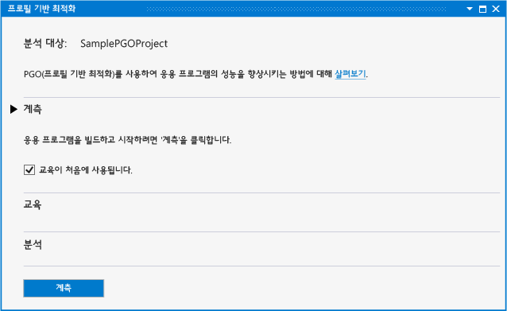
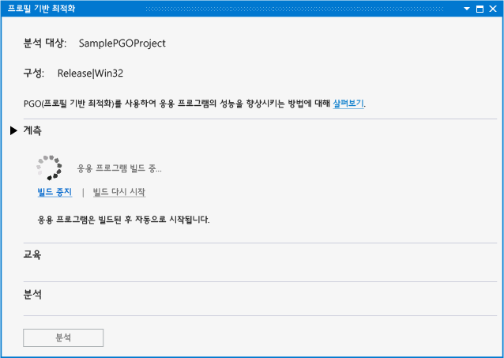
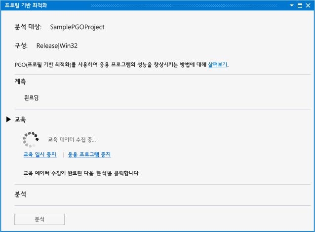
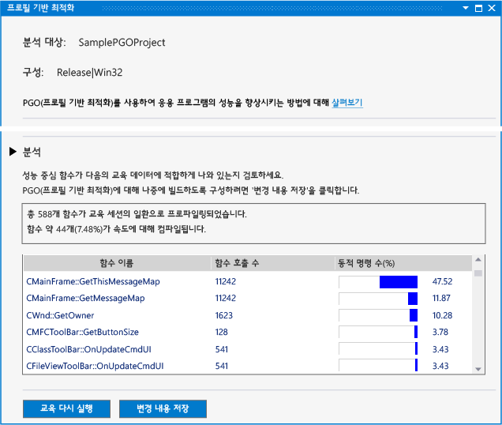
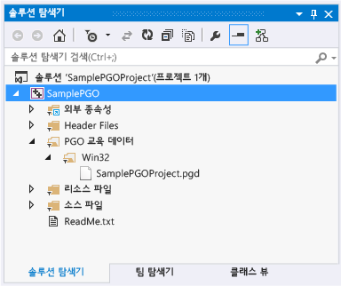
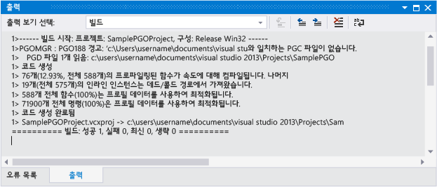

# 성능 및 진단 허브의 프로필 기반 최적화
[!INCLUDE[vs2017banner](../../assembler/inline/includes/vs2017banner.md)]

성능 및 진단 허브에서 Visual C\+\+ 플러그인에 대한 프로필 기반 최적화는 개발자를 위한 프로필 기반 최적화 환경을 향상시켜 줍니다.  Visual Studio 웹 사이트에서 [플러그 인을 다운로드](http://go.microsoft.com/fwlink/p/?LinkId=327915)\(영문\)할 수 있습니다.  
  
 PGO\(프로필 기반 최적화\)는 사용자의 상호 작용 방식에 최적화된 x86 및 x64 네이티브 응용 프로그램을 빌드하는 데 도움을 줍니다.  PGO는 다중 단계 프로세스입니다. 프로파일링을 위해 계측된 응용 프로그램 빌드를 만든 후 "교육"을 수행합니다. 즉, 공통 사용자 상호 작용 시나리오를 통해 계측된 응용 프로그램을 실행합니다.  캡처된 프로파일링 데이터를 저장한 다음에는 결과를 사용해서 전체 프로그램 최적화를 안내하도록 응용 프로그램을 다시 빌드합니다.  Visual Studio 또는 명령줄에서 이러한 단계를 개별적으로 수행할 수 있지만 PGO 플러그인은 이 프로세스를 중앙화하고 간소화합니다.  PGO 플러그인은 필요한 모든 옵션을 설정하고, 각 단계를 안내하고, 분석을 보여주고, 결과를 사용해서 크기 및 속도에 맞게 각 기능을 최적화하도록 빌드를 구성합니다.  또한 PGO 플러그인을 사용하면 응용 프로그램 교육을 쉽게 다시 실행하고 코드를 변경할 때 빌드 최적화 데이터를 업데이트할 수 있습니다.  
  
## 필수 구성 요소  
 성능 및 진단 허브에서 사용할 수 있으려면 먼저 [PGO 플러그 인을 다운로드](http://go.microsoft.com/fwlink/p/?LinkId=327915)\(영문\)하고 Visual Studio에 설치해야 합니다.  
  
## 연습: PGO 플러그인을 사용하여 응용 프로그램 최적화  
 우선, Visual Studio에서 기본 Win32 데스크톱 응용 프로그램을 만듭니다.  최적화하려는 네이티브 응용 프로그램이 이미 있으면 이를 사용하고 이 단계는 건너뛸 수 있습니다.  
  
#### 응용 프로그램을 만들려면  
  
1.  메뉴 모음에서 **파일**, **새로 만들기**, **프로젝트**를 차례로 선택합니다.  
  
2.  **새 프로젝트** 대화 상자 왼쪽 창의 **설치됨**, **템플릿**, **Visual C\+\+**를 차례로 확장하고 **MFC**를 선택합니다.  
  
3.  가운데 창에서, **MFC 응용 프로그램**을 선택합니다.  
  
4.  **이름** 상자에 프로젝트 이름을 지정합니다\(예: SamplePGOProject\).  **확인** 단추를 선택합니다.  
  
5.  **MFC 응용 프로그램 마법사** 대화 상자의 **개요** 페이지에서 **마침** 단추를 선택합니다.  
  
 그런 다음, 응용 프로그램의 빌드 구성을 릴리스로 설정해서 PGO 빌드 및 교육 단계를 준비합니다.  
  
#### 빌드 구성을 설정하려면  
  
1.  메뉴 모음에서 **빌드**, **구성 관리자**를 선택합니다.  
  
2.  **구성 관리자** 대화 상자에서 **활성 솔루션 구성** 드롭다운 단추를 선택하고 **릴리스**를 선택합니다.  **닫기** 단추를 선택합니다.  
  
 메뉴 모음에서 성능 및 진단 허브를 열고 **분석**, **성능 및 진단**을 선택합니다.  그러면 프로젝트 형식에 사용할 수 있는 분석 도구가 포함된 진단 세션 페이지가 열립니다.  
  
   
  
 **사용 가능한 도구**에서 **프로필 기반 최적화** 확인란을 선택합니다.  **시작** 단추를 선택하여 PGO 플러그인을 시작합니다.  
  
   
  
 **프로필 기반 최적화** 페이지에서는 응용 프로그램의 성능을 향상 시키기 위해 플러그인에서 사용되는 단계에 대해 설명합니다.  **시작** 단추를 선택합니다.  
  
   
  
 **계측** 섹션에서 **교육이 처음 설정됨** 옵션을 사용하여 교육의 일부에 응용 프로그램의 시작 단계를 포함할지 여부를 선택합니다.  이 옵션을 선택하지 않으면, 교육을 명시적으로 설정할 때까지 실행 중인 계측된 응용 프로그램에서 교육 데이터가 기록되지 않습니다.  
  
 **계측** 단추를 선택하여 특별한 컴파일러 옵션 집합으로 응용 프로그램을 빌드합니다.  컴파일러가 생성된 코드에 검사 지침을 삽입합니다.  이러한 지침은 교육 단계 중에 프로파일링 데이터를 기록합니다.  
  
   
  
 응용 프로그램의 계측된 빌드가 완료되면 응용 프로그램이 자동으로 시작됩니다.  
  
 빌드하는 동안 오류 또는 경고가 발생하면, 이를 수정한 후 **빌드 다시 시작** 을 선택하여 계측된 빌드를 다시 시작합니다.  
  
 응용 프로그램이 시작되면 **교육** 섹션에서 **교육 시작** 및 **교육 일시 중지** 링크를 사용하여 프로파일링 정보가 기록되는 시간을 제어할 수 있습니다.  **응용 프로그램 중지** 및 **응용 프로그램 시작** 링크를 사용하여 응용 프로그램을 중지하고 다시 시작할 수 있습니다.  
  
   
  
 교육을 하는 동안, 시나리오를 살펴보고 코드를 최적화하기 위해 PGO 플러그인에 필요한 프로파일링 정보를 캡처합니다.  교육을 완료했으면 응용 프로그램을 닫거나 **응용 프로그램 중지** 링크를 선택합니다.  **분석** 단추를 선택하여 분석 단계를 시작합니다.  
  
 분석이 완료 되면 **분석** 섹션에 사용자 시나리오 교육 단계 중에 캡처된 프로파일링 정보의 보고서가 표시됩니다.  이 보고서에서는 사용자의 응용 프로그램이 호출한 기능 및 가장 많은 시간이 소비된 함수를 조사할 수 있습니다.  PGO 플러그인은 이 정보를 사용해서 속도를 최적화할 응용 프로그램 기능과 크기를 최적화할 기능을 확인할 수 있습니다.  PGO 플러그인은 교육 중 기록한 사용자 시나리오에 대해 가장 작고 가장 빠른 응용 프로그램을 만들기 위한 빌드 최적화를 구성합니다.  
  
   
  
 교육으로 예상된 프로파일링 정보가 캡처되었으면 **변경 내용 저장** 을 선택해서 이후 빌드 최적화를 위해 프로젝트에 분석된 프로필 데이터를 저장할 수 있습니다.  프로필 데이터를 삭제하고 처음부터 다시 교육을 시작하려면, **교육 다시 실행**을 선택합니다.  
  
 프로필 데이터 파일은 **PGO 교육 데이터** 폴더에 있는 프로젝트에 저장됩니다.  이 데이터는 응용 프로그램에서 컴파일러 빌드 최적화 설정을 제어하는 데 사용됩니다.  
  
   
  
 분석 후, PGO 플러그인은 컴파일 중 프로필 데이터를 사용해서 응용 프로그램을 선택적으로 최적화할 수 있도록 프로젝트에서 빌드 옵션을 설정합니다.  계속해서 동일한 프로필 데이터를 사용해서 응용 프로그램을 수정하고 빌드할 수 있습니다.  응용 프로그램이 빌드되었으면 빌드 출력에 프로필 데이터를 사용해서 얼마나 많은 기능 및 명령이 최적화되었는지 보고됩니다.  
  
   
  
 개발 중 상당한 코드를 변경한 경우 최상의 최적화 효과를 얻기 위해 응용 프로그램을 다시 교육해야 할 수 있습니다.  프로필 데이터를 사용해서 80% 이하의 기능 또는 명령이 최적화된 것으로 빌드 출력에 보고될 경우 응용 프로그램을 다시 교육하는 것이 좋습니다.