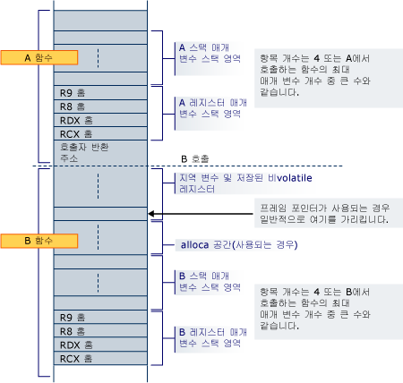

# 스택 할당
[!INCLUDE[vs2017banner](../assembler/inline/includes/vs2017banner.md)]

함수의 프롤로그는 지역 변수, 저장 레지스터, 스택 매개 변수 및 레지스터 매개 변수를 위해 스택 공간을 할당하는 역할을 합니다.  
  
 매개 변수 영역은 alloca가 사용된 경우에도 항상 스택의 맨 아래에 있습니다. 따라서 모든 함수 호출에서 이 영역은 반환 주소와 항상 인접하게 됩니다.  이 영역에는 적어도 네 개의 항목이 있으며, 호출되는 함수에서 필요한 매개 변수를 모두 저장하기에 충분한 공간이 항상 확보됩니다.  스택에 매개 변수를 넣지 않는 경우에도 레지스터 매개 변수를 위한 공간이 항상 할당됩니다. 따라서 호출 수신자의 매개 변수를 위한 공간이 항상 미리 할당됩니다.  호출되는 함수에서 인수 목록\(va\_list\)의 주소나 개별 인수를 가져와야 하는 경우에 인접 영역을 사용할 수 있도록 레지스터 인수에는 홈 주소가 필요합니다.  또한 이 영역은 썽크 실행 도중 및 디버깅 옵션에서 레지스터 인수를 저장하기에 편리합니다. 예를 들어 프롤로그 코드에서 인수를 홈 주소에 저장하면 디버깅 도중 인수를 쉽게 검색할 수 있습니다.  4개 미만의 매개 변수를 사용하는 호출되는 함수에서도 실제로 4개의 스택 위치를 소유합니다. 호출되는 함수에서는 이러한 스택 위치를 매개 변수 레지스터 값을 저장하는 것 외에 다른 목적으로 사용할 수 있습니다.  따라서 호출자는 함수 호출에서 이 스택 영역에 정보를 저장하지 않는 것이 좋습니다.  
  
 함수에서 공간을 동적으로 할당\(alloca\)하는 경우 비volatile 레지스터를 프레임 포인터로 사용하여 스택에서 고정 부분의 맨 아래 주소를 표시해야 하고, 프롤로그에서 이 레지스터를 저장하고 초기화해야 합니다.  alloca를 사용하는 경우 동일한 호출자가 동일한 호출 수신자를 호출해도 레지스터 매개 변수에 대한 홈 주소는 다를 수 있습니다.  
  
 스택은 항상 16바이트 맞춤으로 유지됩니다. 단, 프롤로그 안에서\(반환 주소를 푸시한 후 등\) 및 특정 종류의 프레임 함수에 대한 [함수 형식](../build/function-types.md)에 특별히 지정되어 있는 경우는 예외입니다.  
  
 다음 예제 스택 레이아웃에서는 A 함수에서 리프가 아닌 B 함수를 호출합니다.  A 함수의 프롤로그는 B 함수에서 필요한 모든 레지스터 및 스택 매개 변수에 대한 공간을 스택의 맨 아래에 이미 할당했습니다.  B 함수를 호출하면 반환 주소가 푸시되고, B의 프롤로그는 지역 변수, 비volatile 레지스터 및 함수 호출에 필요한 공간을 할당합니다.  B에서 alloca를 사용하면 지역 변수\/비volatile 레지스터 저장 영역과 매개 변수 스택 영역 사이에 공간이 할당됩니다.  
  
   
  
 B 함수에서 다른 함수를 호출하면 RCX에 대한 홈 주소 바로 아래에 반환 주소가 푸시됩니다.  
  
## 참고 항목  
 [스택 사용](../build/stack-usage.md)