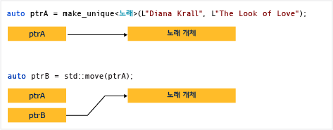

# 방법: unique_ptr 인스턴스 만들기 및 사용
[!INCLUDE[vs2017banner](../assembler/inline/includes/vs2017banner.md)]

[unique\_ptr](../standard-library/unique-ptr-class.md)은 포인터를 공유하지 않습니다.  다른 `unique_ptr`로 복사하거나, 함수에 값으로 전달하거나 사본이 필요한 STL\(표준 템플릿 라이브러리\) 알고리즘에서는 사용할 수 없습니다.  `unique_ptr`은 이동만 할 수 있습니다.  즉, 메모리 리소스의 소유권이 다른 `unique_ptr`로 이전되어 원래 `unique_ptr`이 더 이상 소유하지 않습니다.  소유권이 여러 개이면 프로그램 논리가 복잡해지기 때문에 개체를 하나의 소유자로 제한하는 것이 좋습니다.  따라서 일반 C\+\+ 개체에 대한 스마트 포인터가 필요할 경우 `unique_ptr`을 사용하고, `unique_ptr`을 생성할 경우 [make\_unique](../Topic/make_unique.md) 도우미 함수를 사용합니다.  
  
 다음 다이어그램은 두 `unique_ptr` 인스턴스 사이의 소유권 이전을 보여 줍니다.  
  
   
  
 `unique_ptr`은 STL의 `<memory>` 헤더에 정의됩니다.  원시 포인터만큼 매우 효율적이며 STL 컨테이너에서 사용할 수 있습니다.  `unique_ptr`의 이동 생성자는 복사 작업을 수행할 필요가 없기 때문에 STL 컨테이너에 `unique_ptr` 인스턴스를 추가하는 것이 효율적입니다.  
  
## 예제  
 다음 예제에서는 `unique_ptr` 인스턴스를 어떻게 만들고 이를 함수 사이에서 어떻게 전달하는지를 보여 줍니다.  
  
 [!code-cpp[stl_smart_pointers#210](../cpp/codesnippet/CPP/how-to-create-and-use-unique-ptr-instances_1.cpp)]  
  
 이러한 예는 `unique_ptr`의 기본적인 특징을 보여 주며 이동은 가능하지만 복사되지 않을 수 있습니다. "이동"이 소유권을 새 `unique_ptr`로 이전하고 이전 `unique_ptr`을 다시 설정합니다.  
  
## 예제  
 다음 예제에서는 `unique_ptr` 인스턴스를 만들고 이를 벡터에 사용하는 방법을 보여 줍니다.  
  
 [!code-cpp[stl_smart_pointers#211](../cpp/codesnippet/CPP/how-to-create-and-use-unique-ptr-instances_2.cpp)]  
  
 루프 범위에서 `unique_ptr`이 참조로 전달됩니다.  여기에서 값으로 전달하려는 경우 `unique_ptr` 복사 생성자가 삭제되기 때문에 컴파일러는 오류를 throw합니다.  
  
## 예제  
 다음 예제에서는 클래스 멤버인 `unique_ptr`을 초기화하는 방법을 보여 줍니다.  
  
 [!code-cpp[stl_smart_pointers#212](../cpp/codesnippet/CPP/how-to-create-and-use-unique-ptr-instances_3.cpp)]  
  
## 예제  
 [make\_unique](../Topic/make_unique.md)를 사용하여 배열에 대한 `unique_ptr`을 만들 수 있지만, `make_unique`를 사용하여 배열 요소를 초기화할 수는 없습니다.  
  
 [!code-cpp[stl_smart_pointers#213](../cpp/codesnippet/CPP/how-to-create-and-use-unique-ptr-instances_4.cpp)]  
  
 추가 예제는 [make\_unique](../Topic/make_unique.md)를 참조하십시오.  
  
## 참고 항목  
 [스마트 포인터](../cpp/smart-pointers-modern-cpp.md)   
 [make\_unique](../Topic/make_unique.md)