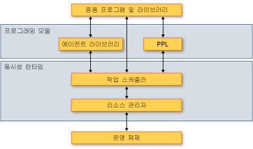

# 동시성 런타임 개요
[!INCLUDE[vs2017banner](../../assembler/inline/includes/vs2017banner.md)]

이 문서에서는 동시성 런타임에 대한 개요를 제공합니다.  또한 동시성 런타임의 이점, 사용할 시기, 구성 요소가 서로 상호 작용하는 방식과 운영 체제 및 응용 프로그램과 상호 작용하는 방식에 대해 설명합니다.  
  
> [!IMPORTANT]
>  Visual Studio 2015 이상에서는 동시성 런타임 작업 스케줄러가 더 이상 ppltasks.h에 있는 작업 클래스 및 관련 형식에 대한 스케줄러가 아닙니다.  이제 이러한 형식에서는 성능 향상 및 Windows 동기화 기본 형식과의 상호 운용성을 위해 Windows 스레드 풀을 사용합니다.  Parallel\_for와 같은 병렬 알고리즘에서는 동시성 런타임 작업 스케줄러를 계속 사용합니다.  
  
##   섹션  
 이 문서에는 다음 섹션이 포함됩니다.  
  
-   [동시성 런타임이 중요한 이유](#runtime)  
  
-   [아키텍처](#architecture)  
  
-   [C\+\+ 람다 식](#lambda)  
  
-   [요구 사항](#requirements)  
  
##   동시성 런타임이 중요한 이유  
 동시성 런타임은 동시에 실행되는 응용 프로그램 및 응용 프로그램 구성 요소에 통일성 및 예측 가능성을 제공합니다.  동시성 런타임의 두 가지 이점은 *협조적 작업 일정* 및 *협조적 차단*입니다.  
  
 동시성 런타임에서는 작업 가로채기 알고리즘을 구현하는 협조적 작업 스케줄러를 사용하여 컴퓨팅 리소스 간에 작업을 효율적으로 분산시킵니다.  예를 들어 두 스레드가 동일한 런타임에서 관리되는 응용 프로그램을 살펴보겠습니다.  한 스레드가 예약된 작업을 완료하면 다른 스레드에서 작업을 오프로드할 수 있습니다.  이 메커니즘은 응용 프로그램의 전체 작업을 분산시킵니다.  
  
 또한 동시성 런타임은 협조적 차단을 사용하여 리소스에 대한 액세스를 동기화하는 동기화 기본 형식을 제공합니다.  예를 들어 공유 리소스에 단독으로 액세스해야 하는 작업을 살펴보겠습니다.  협조적으로 차단하면 첫 번째 작업에서 리소스를 기다리는 동안 런타임에서 나머지 퀀텀을 사용하여 다른 작업을 수행할 수 있습니다.  이 메커니즘을 통해 컴퓨팅 리소스의 최대 사용량이 증가합니다.  
  
 \[[맨 위로 이동](#top)\]  
  
##   아키텍처  
 동시성 런타임은 PPL\(병렬 패턴 라이브러리\), 비동기 에이전트 라이브러리, 작업 스케줄러 및 리소스 관리자의 네 가지 구성 요소로 구분됩니다.  이러한 구성 요소는 운영 체제와 응용 프로그램 사이에 있습니다.  다음 그림에서는 동시성 런타임 구성 요소가 운영 체제 및 응용 프로그램 사이에서 상호 작용하는 방식을 보여 줍니다.  
  
 **동시성 런타임 아키텍처**  
  
   
  
> [!IMPORTANT]
>  작업 스케줄러 및 리소스 관리자 구성 요소는 [!INCLUDE[win8_appname_long](../../build/includes/win8_appname_long_md.md)] 앱에서나 ppltasks.h에 있는 작업 클래스나 기타 형식을 사용하는 경우에 사용할 수 없습니다.  
  
 동시성 런타임은 *구성 가능성*이 뛰어납니다. 즉, 기존 기능을 결합하여 더 많은 작업을 수행할 수 있습니다.  동시성 런타임은 하위 수준의 구성 요소에서 병렬 알고리즘과 같은 많은 기능을 작성합니다.  
  
 또한 동시성 런타임은 협조적 차단을 사용하여 리소스에 대한 액세스를 동기화하는 동기화 기본 형식을 제공합니다.  이러한 동기화 기본 형식에 대한 자세한 내용은 [동기화 데이터 구조](../../parallel/concrt/synchronization-data-structures.md)를 참조하세요.  
  
 다음 섹션에서는 각 구성 요소에서 제공하는 기능 및 사용되는 경우에 대한 간략한 개요를 제공합니다.  
  
### 병렬 패턴 라이브러리  
 PPL\(병렬 패턴 라이브러리\)은 세부적인 병렬 처리를 수행하기 위한 범용 컨테이너 및 알고리즘을 제공합니다.  PPL에서는 컬렉션 또는 데이터 집합에 대한 계산을 컴퓨팅 리소스 간에 분산시키는 병렬 알고리즘을 제공하여 *명령적 데이터 병렬 처리*를 사용합니다.  또한 여러 개의 독립적인 작업을 컴퓨팅 리소스 간에 분산시키는 작업 개체를 제공하여 *작업 병렬 처리*를 사용합니다.  
  
 병렬 패턴 라이브러리는 병렬 실행의 이점을 활용할 수 있는 로컬 계산이 있는 경우에 사용합니다.  예를 들어 [concurrency::parallel\_for](../Topic/parallel_for%20Function.md) 알고리즘을 사용하여 기존 `for` 루프를 병렬로 동작하도록 변환할 수 있습니다.  
  
 병렬 패턴 라이브러리에 대한 자세한 내용은 [PPL\(병렬 패턴 라이브러리\)](../../parallel/concrt/parallel-patterns-library-ppl.md)을 참조하세요.  
  
### 비동기 에이전트 라이브러리  
 비동기 에이전트 라이브러리\(또는 간단히 *에이전트 라이브러리*라고도 함\)는 정교하지 않은 데이터 흐름 및 파이프라인 작업에 행위자 기반 프로그래밍 모델 및 메시지 전달 인터페이스를 제공합니다.  비동기 에이전트를 사용하면 다른 구성 요소에서 데이터를 기다리는 동안 작업을 수행하여 대기 시간을 생산적으로 사용할 수 있습니다.  
  
 에이전트 라이브러리는 서로 비동기적으로 통신하는 여러 엔터티가 있는 경우에 사용합니다.  예를 들어 파일 또는 네트워크 연결에서 데이터를 읽은 다음 메시지 전달 인터페이스를 사용하여 해당 데이터를 다른 에이전트로 보내는 에이전트를 만들 수 있습니다.  
  
 에이전트 라이브러리에 대한 자세한 내용은 [비동기 에이전트 라이브러리](../../parallel/concrt/asynchronous-agents-library.md)를 참조하세요.  
  
### 작업 스케줄러  
 작업 스케줄러는 런타임에 작업을 예약하고 조정합니다.  작업 스케줄러는 협조적이며 작업 가로채기 알고리즘을 사용하여 처리 리소스의 최대 사용량을 달성합니다.  
  
 동시성 런타임은 기본 스케줄러를 제공하므로 인프라 세부 정보를 관리할 필요가 없습니다.  그러나 응용 프로그램의 품질 요구 사항을 충족하려면 고유한 일정 예약 정책을 제공하거나 특정 스케줄러를 특정 작업에 연결할 수도 있습니다.  
  
 작업 스케줄러에 대한 자세한 내용은 [작업 스케줄러](../../parallel/concrt/task-scheduler-concurrency-runtime.md)를 참조하세요.  
  
### 리소스 관리자  
 리소스 관리자의 역할은 프로세서 및 메모리와 같은 컴퓨팅 리소스를 관리하는 것입니다.  리소스 관리자는 가장 효과적일 수 있는 위치에 리소스를 할당함으로써 런타임에 변경되는 경우 작업에 응답합니다.  
  
 리소스 관리자는 컴퓨팅 리소스에 대해 추상화 역할을 하며 주로 작업 스케줄러와 상호 작용합니다.  리소스 관리자를 사용하여 라이브러리 및 응용 프로그램의 성능을 세밀하게 조정할 수 있지만 일반적으로 병렬 패턴 라이브러리, 에이전트 라이브러리 및 작업 스케줄러에서 제공하는 기능을 사용합니다.  이러한 라이브러리는 리소스 관리자를 사용하여 작업이 변경될 때 리소스를 동적으로 다시 분산시킵니다.  
  
 \[[맨 위로 이동](#top)\]  
  
##   C\+\+ 람다 식  
 동시성 런타임에 의해 정의되는 많은 형식 및 알고리즘은 C\+\+ 템플릿으로 구현됩니다.  이러한 형식 및 알고리즘의 일부는 작업을 수행하는 루틴을 매개 변수로 사용합니다.  이러한 매개 변수는 람다 함수, 함수 개체 또는 함수 포인터일 수 있습니다.  이러한 엔터티를 *작업 함수* 또는 *작업 루틴*이라고도 합니다.  
  
 람다 식은 중요한 새 Visual C\+\+ 언어 기능으로 병렬 처리를 위한 작업 함수를 정의하는 간단한 방법을 제공합니다.  함수 개체 및 함수 포인터를 사용하면 기존 코드에서 동시성 런타임을 사용할 수 있습니다.  그러나 제공되는 안전성 및 생산성 이점으로 인해 새 코드를 작성하는 경우에는 람다 식을 사용하는 것이 좋습니다.  
  
 다음 예제에서는 여러 호출에서 람다 함수, 함수 개체 및 함수 포인터의 구문을 [concurrency::parallel\_for\_each](../Topic/parallel_for_each%20Function.md) 알고리즘과 비교합니다.  `parallel_for_each`를 호출할 때마다 다른 기술을 사용하여 [std:: array](../../standard-library/array-class-stl.md) 개체에 있는 각 요소의 제곱을 계산합니다.  
  
 [!code-cpp[concrt-comparing-work-functions#1](../../parallel/concrt/codesnippet/CPP/overview-of-the-concurrency-runtime_1.cpp)]  
  
 **출력**  
  
  **1**  
**256**  
**6561**  
**65536**  
**390625** C\+\+의 람다 식에 대한 자세한 내용은 [람다 식](../../cpp/lambda-expressions-in-cpp.md)을 참조하세요.  
  
 \[[맨 위로 이동](#top)\]  
  
##   요구 사항  
 다음 표에서는 동시성 런타임의 각 구성 요소와 연관된 헤더 파일을 보여 줍니다.  
  
|구성 요소|Header Files|  
|-----------|------------------|  
|PPL\(병렬 패턴 라이브러리\)|ppl.h   concurrent\_queue.h   concurrent\_vector.h|  
|비동기 에이전트 라이브러리|agents.h|  
|작업 스케줄러|concrt.h|  
|리소스 관리자|concrtrm.h|  
  
 동시성 런타임은 [동시성](../../parallel/concrt/reference/concurrency-namespace.md) 네임스페이스에 선언됩니다.  \(이 네임 스페이스에 대한 별칭인 [concurrency](../../parallel/concrt/reference/concurrency-namespace.md)를 사용할 수 있습니다.\) `concurrency::details` 네임스페이스는 동시성 런타임 프레임워크를 지원하며 사용자 코드에서 직접 사용할 수 없습니다.  
  
 동시성 런타임은 CRT\(C 런타임 라이브러리\)의 일부로 제공됩니다.  CRT를 사용하는 응용 프로그램을 빌드하는 방법에 대한 자세한 내용은 [CRT 라이브러리 기능](../../c-runtime-library/crt-library-features.md)를 참조하세요.  
  
 \[[맨 위로 이동](#top)\]