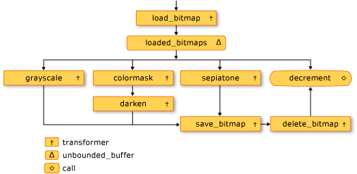
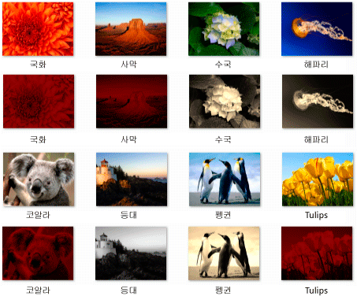

# 연습: 이미지 처리 네트워크 만들기
[!INCLUDE[vs2017banner](../../assembler/inline/includes/vs2017banner.md)]

이 문서에서는 이미지 처리를 수행하는 비동기 메시지 블록의 네트워크를 만드는 방법을 보여 줍니다.  
  
 네트워크는 특징을 기준으로 이미지에 대해 수행할 작업을 결정합니다.  이 예제에서는 *데이터 흐름* 모델을 사용하여 네트워크를 통해 이미지 경로를 지정합니다.  데이터 모델에서 프로그램의 독립 구성 요소는 메시지를 보내 서로 통신합니다.  구성 요소가 메시지를 받으면 임의의 동작을 수행한 다음 해당 동작의 결과를 다른 구성 요소에 전달합니다.  데이터 흐름 모델을 *제어 흐름* 모델과 비교해 볼 수 있습니다. 제어 흐름 모델의 경우 응용 프로그램에서 조건문, 루프 등의 제어 구조를 사용하여 프로그램의 작업 순서를 제어합니다.  
  
 데이터 흐름을 기반으로 하는 네트워크에서는 작업의 *파이프라인*을 만듭니다.  파이프라인의 각 단계는 전체 작업의 각 부분을 동시에 수행합니다.  자동차 제조를 위한 조립과 비슷하다고 생각하면 됩니다.  각 자동차를 조립 라인에 전달하면 한 작업장에서는 프레임을 조립하고 다른 작업장에서는 엔진을 장착하는 식입니다.  여러 대의 자동차를 동시에 조립할 수 있으면 한 번에 자동차 한 대 전체를 조립할 때보다 조립 라인의 처리량이 향상됩니다.  
  
## 사전 요구 사항  
 이 연습을 시작하기 전에 다음 문서를 읽어 보십시오.  
  
-   [비동기 메시지 블록](../../parallel/concrt/asynchronous-message-blocks.md)  
  
-   [방법: 메시지 블록 필터 사용](../../parallel/concrt/how-to-use-a-message-block-filter.md)  
  
-   [연습: 데이터 흐름 에이전트 만들기](../../parallel/concrt/walkthrough-creating-a-dataflow-agent.md)  
  
 또한 이 연습을 시작하기 전에 [!INCLUDE[ndptecgdiplus](../../parallel/concrt/includes/ndptecgdiplus_md.md)]의 기본 사항을 이해하는 것이 좋습니다.  [!INCLUDE[ndptecgdiplus](../../parallel/concrt/includes/ndptecgdiplus_md.md)]에 대한 자세한 내용은 [GDI\+](_gdiplus_GDI_start_cpp)를 참조하십시오.  
  
##   단원  
 이 연습에는 다음 단원이 포함되어 있습니다.  
  
-   [이미지 처리 기능 정의](#functionality)  
  
-   [이미지 처리 네트워크 만들기](#network)  
  
-   [전체 예제](#complete)  
  
##   이미지 처리 기능 정의  
 이 단원에서는 이미지 처리 네트워크가 디스크에서 읽은 이미지에 대한 작업 시 사용하는 지원 기능을 보여 줍니다.  
  
 `GetRGB` 및 `MakeColor` 함수는 각각 지정된 색의 개별 구성 요소를 추출하고 결합합니다.  
  
 [!code-cpp[concrt-image-processing-filter#2](../../parallel/concrt/codesnippet/CPP/walkthrough-creating-an-image-processing-network_1.cpp)]  
  
 `ProcessImage` 함수는 지정된 [std::function](../../standard-library/function-class.md) 개체를 호출하여 [!INCLUDE[ndptecgdiplus](../../parallel/concrt/includes/ndptecgdiplus_md.md)] [Bitmap](https://msdn.microsoft.com/en-us/library/ms534420.aspx) 개체에 있는 각 픽셀의 색상 값을 변환합니다.  `ProcessImage` 함수는 [concurrency::parallel\_for](../Topic/parallel_for%20Function.md) 알고리즘을 사용하여 비트맵의 각 행을 병렬로 처리합니다.  
  
 [!code-cpp[concrt-image-processing-filter#3](../../parallel/concrt/codesnippet/CPP/walkthrough-creating-an-image-processing-network_2.cpp)]  
  
 `Grayscale`, `Sepiatone`, `ColorMask` 및 `Darken` 함수는 `ProcessImage` 함수를 호출하여 `Bitmap` 개체에 있는 각 픽셀의 색상 값을 변환합니다.  이러한 각각의 함수는 람다 식을 사용하여 1픽셀의 색 변환을 정의합니다.  
  
 [!code-cpp[concrt-image-processing-filter#4](../../parallel/concrt/codesnippet/CPP/walkthrough-creating-an-image-processing-network_3.cpp)]  
  
 `GetColorDominance` 함수는 `ProcessImage` 함수도 호출합니다.  그러나 이 함수는 각 색상 값을 변경하는 대신 [concurrency::combinable](../../parallel/concrt/reference/combinable-class.md) 개체를 사용하여 빨간색, 녹색 또는 파란색 구성 요소가 이미지보다 우위를 차지하는지 여부를 계산합니다.  
  
 [!code-cpp[concrt-image-processing-filter#5](../../parallel/concrt/codesnippet/CPP/walkthrough-creating-an-image-processing-network_4.cpp)]  
  
 `GetEncoderClsid`함수는 인코더의 지정된 MIME 형식에 대한 클래스 식별자를 검색합니다.  응용 프로그램에서는 이 함수를 사용하여 비트맵의 인코더를 검색합니다.  
  
 [!code-cpp[concrt-image-processing-filter#6](../../parallel/concrt/codesnippet/CPP/walkthrough-creating-an-image-processing-network_5.cpp)]  
  
 \[[맨 위](#top)\]  
  
##   이미지 처리 네트워크 만들기  
 이 단원에서는 지정된 디렉터리의 모든 [!INCLUDE[TLA#tla_jpeg](../../parallel/concrt/includes/tlasharptla_jpeg_md.md)] 이미지\(.jpg\)에 대한 이미지 처리를 수행하는 비동기 메시지 블록의 네트워크를 만드는 방법에 대해 설명합니다.  네트워크는 다음과 같은 이미지 처리 작업을 수행합니다.  
  
1.  Tom이 작성한 모든 이미지를 회색조로 변환합니다.  
  
2.  빨간색을 주요 색으로 포함하고 있는 이미지의 경우 녹색 및 파란색 구성 요소를 제거한 다음 이미지를 어둡게 만듭니다.  
  
3.  다른 모든 이미지에는 세피아 톤을 적용합니다.  
  
 네트워크는 이러한 조건 중 하나와 일치하는 첫 번째 이미지 처리 작업만 적용합니다.  예를 들어 Tom이 작성한 이미지의 주요 색이 빨간색인 경우 이 이미지는 회색조로 변환만 됩니다.  
  
 네트워크는 각 이미지 처리 작업을 수행한 후 해당 이미지를 비트맵 파일\(.bmp\)로 디스크에 저장합니다.  
  
 다음 단계에서는 이 이미지 처리 네트워크를 구현하고 해당 네트워크를 지정된 디렉터리의 모든 [!INCLUDE[TLA#tla_jpeg](../../parallel/concrt/includes/tlasharptla_jpeg_md.md)] 이미지에 적용하는 함수를 만드는 방법을 보여 줍니다.  
  
#### 이미지 처리 네트워크를 만들려면  
  
1.  디스크의 디렉터리 이름을 사용하는 `ProcessImages` 함수를 만듭니다.  
  
     [!code-cpp[concrt-image-processing-filter#7](../../parallel/concrt/codesnippet/CPP/walkthrough-creating-an-image-processing-network_6.cpp)]  
  
2.  `ProcessImages` 함수에서 `countdown_event` 변수를 만듭니다.  `countdown_event` 클래스는 이 연습의 뒷부분에 나옵니다.  
  
     [!code-cpp[concrt-image-processing-filter#8](../../parallel/concrt/codesnippet/CPP/walkthrough-creating-an-image-processing-network_7.cpp)]  
  
3.  `Bitmap` 개체를 원본 파일 이름과 연결하는 [std::map](../../standard-library/map-class.md) 개체를 만듭니다.  
  
     [!code-cpp[concrt-image-processing-filter#9](../../parallel/concrt/codesnippet/CPP/walkthrough-creating-an-image-processing-network_8.cpp)]  
  
4.  이미지 처리 네트워크의 멤버를 정의하도록 다음과 같은 코드를 추가합니다.  
  
     [!code-cpp[concrt-image-processing-filter#10](../../parallel/concrt/codesnippet/CPP/walkthrough-creating-an-image-processing-network_9.cpp)]  
  
5.  네트워크를 연결하도록 다음과 같은 코드를 추가합니다.  
  
     [!code-cpp[concrt-image-processing-filter#11](../../parallel/concrt/codesnippet/CPP/walkthrough-creating-an-image-processing-network_10.cpp)]  
  
6.  디렉터리에 있는 각 [!INCLUDE[TLA#tla_jpeg](../../parallel/concrt/includes/tlasharptla_jpeg_md.md)] 파일의 전체 경로를 네트워크 헤드에 보내도록 다음과 같은 코드를 추가합니다.  
  
     [!code-cpp[concrt-image-processing-filter#12](../../parallel/concrt/codesnippet/CPP/walkthrough-creating-an-image-processing-network_11.cpp)]  
  
7.  `countdown_event` 변수가 0이 될 때까지 기다립니다.  
  
     [!code-cpp[concrt-image-processing-filter#13](../../parallel/concrt/codesnippet/CPP/walkthrough-creating-an-image-processing-network_12.cpp)]  
  
 다음 표에서는 네트워크 멤버에 대해 설명합니다.  
  
|멤버|설명|  
|--------|--------|  
|`load_bitmap`|디스크에서 `Bitmap` 개체를 로드하고 이미지를 원본 파일 이름에 연결하도록 `map` 개체에 항목을 추가하는 [concurrency::transformer](../../parallel/concrt/reference/transformer-class.md) 개체입니다.|  
|`loaded_bitmaps`|로드된 이미지를 이미지 처리 필터에 보내는 [concurrency::unbounded\_buffer](../Topic/unbounded_buffer%20Class.md) 개체입니다.|  
|`grayscale`|Tom이 작성한 이미지를 회색조로 변환하는 `transformer` 개체입니다.  이 개체는 이미지의 메타데이터를 사용하여 작성자를 확인합니다.|  
|`colormask`|주요 색으로 빨간색을 포함하고 있는 이미지에서 녹색 및 파란색 구성 요소를 제거하는 `transformer` 개체입니다.|  
|`darken`|주요 색으로 빨간색을 포함하고 있는 이미지를 어둡게 만드는 `transformer` 개체입니다.|  
|`sepiatone`|Tom이 작성하지 않고 주요 색이 빨간색이 아닌 이미지에 세피아 톤을 적용하는 `transformer` 개체입니다.|  
|`save_bitmap`|처리된 `image`를 디스크에 비트맵으로 저장하는 `transformer` 개체입니다.  `save_bitmap`은 `map` 개체에서 원본 파일 이름을 검색하고 해당 파일 확장명을 .bmp로 변경합니다.|  
|`delete_bitmap`|이미지에 사용하도록 메모리 공간을 확보하는 `transformer` 개체입니다.|  
|`decrement`|네트워크에서 터미널 노드 역할을 하는 [concurrency::call](../../parallel/concrt/reference/call-class.md) 개체입니다.  이 개체는 `countdown_event` 개체를 줄여 이미지가 처리된 기본 응용 프로그램에 신호를 보냅니다.|  
  
 `loaded_bitmaps` 메시지 버퍼는 `unbounded_buffer` 개체로서 `Bitmap` 개체를 여러 수신자에게 제공하므로 중요합니다.  대상 블록이 `Bitmap` 개체를 수락하면 `unbounded_buffer` 개체는 해당 `Bitmap` 개체를 다른 대상에 제공하지 않습니다.  따라서 개체를 `unbounded_buffer` 개체에 연결하는 순서가 중요합니다.  `grayscale`, `colormask` 및 `sepiatone` 메시지 블록은 각각 필터를 사용하여 특정 `Bitmap` 개체만 수락합니다.  `decrement` 메시지 버퍼는 다른 메시지 버퍼에 의해 거부된 모든 `Bitmap` 개체를 수락하므로 `loaded_bitmaps` 메시지 버퍼의 중요한 대상입니다.  `unbounded_buffer` 개체는 메시지를 순서대로 전파하는 데 필요합니다.  따라서 `unbounded_buffer` 개체는 새 대상 블록이 이 개체에 연결될 때까지 차단되며 현재 대상 블록에서 해당 메시지를 수락하지 않을 경우 메시지를 수락합니다.  
  
 응용 프로그램에서 먼저 메시지를 수락하는 하나의 메시지 블록 대신 여러 메시지 블록이 메시지를 처리하도록 요구할 경우 `overwrite_buffer`와 같은 다른 메시지 블록 형식을 사용할 수 있습니다.  `overwrite_buffer` 클래스는 한 번에 하나의 메시지를 포함하지만 해당 메시지를 각 대상으로 전파합니다.  
  
 다음 그림에서는 이미지 처리 네트워크를 보여 줍니다.  
  
   
  
 이 예제의 `countdown_event` 개체를 사용하면 모든 이미지가 처리되었을 때 이미지 처리 네트워크를 통해 기본 응용 프로그램에 알릴 수 있습니다.  `countdown_event` 클래스는 카운터 값이 0이 되면 [concurrency::event](../../parallel/concrt/reference/event-class.md) 개체를 사용하여 신호를 보낼 수 있습니다.  기본 응용 프로그램은 파일 이름을 네트워크에 보낼 때마다 카운터를 증가시킵니다.  네트워크의 터미널 노드는 각 이미지가 처리된 후 카운터를 감소시킵니다.  기본 응용 프로그램은 지정된 디렉터리를 트래버스한 후 `countdown_event` 개체에서 카운터가 0에 도달했다는 신호를 보낼 때까지 기다립니다.  
  
 다음 예제에서는 `countdown_event` 클래스를 보여 줍니다.  
  
 [!code-cpp[concrt-image-processing-filter#14](../../parallel/concrt/codesnippet/CPP/walkthrough-creating-an-image-processing-network_13.cpp)]  
  
 \[[맨 위](#top)\]  
  
##   전체 예제  
 다음 코드에서는 전체 예제를 보여 줍니다.  `wmain` 함수는 [!INCLUDE[ndptecgdiplus](../../parallel/concrt/includes/ndptecgdiplus_md.md)] 라이브러리를 관리하고 `ProcessImages` 함수를 호출하여 `Sample Pictures` 디렉터리의 [!INCLUDE[TLA#tla_jpeg](../../parallel/concrt/includes/tlasharptla_jpeg_md.md)] 파일을 처리합니다.  
  
 [!code-cpp[concrt-image-processing-filter#15](../../parallel/concrt/codesnippet/CPP/walkthrough-creating-an-image-processing-network_14.cpp)]  
  
 다음 그림에서는 샘플 출력을 보여 줍니다.  각 소스 이미지는 수정된 해당 이미지의 위에 있습니다.  
  
   
  
 `Lighthouse`는 Tom Alphin이 작성했으므로 회색조로 변환됩니다.  `Chrysanthemum`, `Desert`, `Koala` 및 `Tulips`는 빨간색을 주요 색으로 포함하고 있으므로 파란색 및 녹색 구성 요소가 제거되고 어두워집니다.  `Hydrangeas`, `Jellyfish` 및 `Penguins`는 기본 조건과 일치하므로 세피아 톤이 됩니다.  
  
 \[[맨 위](#top)\]  
  
### 코드 컴파일  
 예제 코드를 복사하여  Visual Studio 프로젝트 또는 `image-processing-network.cpp` 파일에 붙여 넣고  Visual Studio 명령 프롬프트 창에서 다음 명령을 실행합니다.  
  
 **cl.exe \/DUNICODE \/EHsc image\-processing\-network.cpp \/link gdiplus.lib**  
  
## 참고 항목  
 [동시성 런타임 연습](../../parallel/concrt/concurrency-runtime-walkthroughs.md)