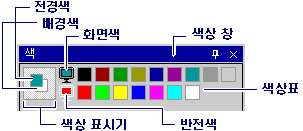

# 색상 창(아이콘에 대한 이미지 편집기)
[!INCLUDE[vs2017banner](../assembler/inline/includes/vs2017banner.md)]

색상 창은 다음과 같은 두 부분으로 구성됩니다.  
  
1.  색 색상표 \- 사용할 수 있는 색을 나타내는 색상 샘플의 배열입니다.  그래픽 도구를 사용할 때 샘플을 클릭하여 전경색 및 배경색을 선택할 수 있습니다.  
  
2.  색 표시기 \- 전경색과 배경색, 화면색 및 반전색 선택기가 표시됩니다.  
  
       
색상 창  
  
> [!NOTE]
>  **화면색** 및 **반전색** 도구는 아이콘과 커서에만 사용할 수 있습니다.  
  
 색상 창은 [이미지 편집기 도구 모음](../mfc/toolbar-image-editor-for-icons.md)에서 사용할 수 있습니다.  
  
 관리되는 프로젝트에 리소스를 추가하는 방법은 .NET Framework 개발자 가이드의 [응용 프로그램의 리소스](../Topic/Resources%20in%20Desktop%20Apps.md)를 참조하십시오. 관리되는 프로젝트에 리소스 파일 추가, 리소스 액세스, 정적 리소스 표시, 속성에 리소스 문자열 할당 등의 작업을 수동으로 수행하는 방법에 대한 자세한 내용은 [Walkthrough: Using Resources for Localization with ASP.NET](../Topic/Walkthrough:%20Using%20Resources%20for%20Localization%20with%20ASP.NET.md)을 참조하세요.  
  
## 요구 사항  
 없음  
  
## 참고 항목  
 [색상 창 표시 또는 숨기기](../windows/displaying-or-hiding-the-colors-window-image-editor-for-icons.md)   
 [Creating Transparent or Inverse Regions in Device Images](../mfc/creating-transparent-or-inverse-regions-in-device-images.md)   
 [Accelerator Keys](../mfc/accelerator-keys-image-editor-for-icons.md)   
 [사용자 지정 색 선택 대화 상자](../windows/custom-color-selector-dialog-box-image-editor-for-icons.md)   
 [Image Editor for Icons](../mfc/image-editor-for-icons.md)