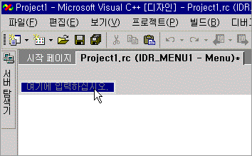
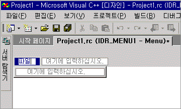

# Creating a Menu
[!INCLUDE[vs2017banner](../assembler/inline/includes/vs2017banner.md)]

> [!NOTE]
>  Express 버전에서는 리소스 창을 사용할 수 없습니다.  
  
### 표준 메뉴를 만들려면  
  
1.  **보기** 메뉴에서 **리소스 뷰**를 클릭한 다음 **메뉴** 제목을 마우스 오른쪽 단추로 클릭하고 **리소스 추가**를 선택합니다.**메뉴**를 선택합니다.  
  
2.  메뉴 모음에서 **새 항목** 상자\(“여기에 입력”이 포함된 사각형\)를 선택합니다.  
  
       
새 항목 상자  
  
3.  예를 들어 "파일"과 같이 새 메뉴의 이름을 입력합니다.  
  
     입력하는 텍스트는 **메뉴** 편집기와 [속성 창](../Topic/Properties%20Window.md)의**캡션** 상자에 모두 나타납니다. 한 위치에서 새 메뉴에 대한 속성을 편집할 수 있습니다.  
  
     메뉴 모음에서 새 메뉴에 이름을 지정하면 새 항목 상자가 오른쪽으로 이동하고\(다른 메뉴를 추가할 수 있도록\), 메뉴 명령을 추가할 수 있도록 또 다른 새 항목 상자가 첫 번째 메뉴 아래에 열립니다.  
  
       
메뉴 이름을 입력한 후 포커스가 이동된 새 항목 상자  
  
    > [!NOTE]
    >  메뉴 모음에서 단일 항목 메뉴를 만들려면 팝업 속성을 False로 설정합니다.  
  
 관리되는 프로젝트에 리소스를 추가하는 방법은 *.NET Framework 개발자 가이드*에서 [응용 프로그램의 리소스](../Topic/Resources%20in%20Desktop%20Apps.md)를 참조하세요. 관리되는 프로젝트에 리소스 파일 추가, 리소스 액세스, 정적 리소스 표시, 속성에 리소스 문자열 할당 등의 작업을 수동으로 수행하는 방법에 대한 자세한 내용은 [연습: Windows Forms 지역화](http://msdn.microsoft.com/ko-kr/9a96220d-a19b-4de0-9f48-01e5d82679e5) 및 [Walkthrough: Using Resources for Localization with ASP.NET](../Topic/Walkthrough:%20Using%20Resources%20for%20Localization%20with%20ASP.NET.md)을 참조하세요.  
  
 **요구 사항**  
  
 Win32  
  
## 참고 항목  
 [Menu Editor](../mfc/menu-editor.md)